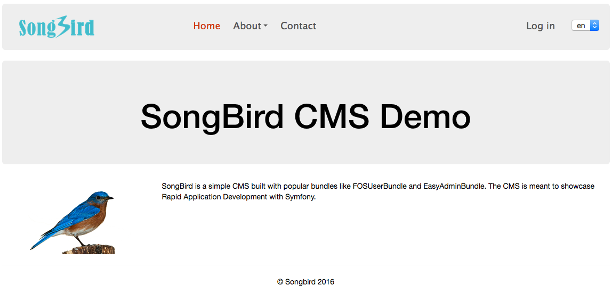

# Introduction

This is the code repo of SongBird - A simple CMS created in Symfony 3.

The manuscript for the whole creation process is documented in a separate [repo](https://github.com/bernardpeh/practical-symfony-3).

The leanpub book is [here](https://leanpub.com/practicalsymfony3/).

See [changelog](CHANGELOG.md) for historical updates.

If you find any typos or errors, feel free to create a pull request.

## Donation

You can show support by purchasing the leanpub book.